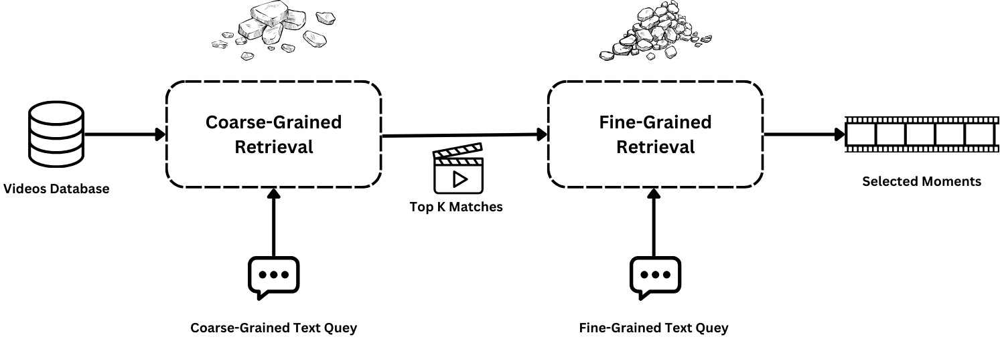

# Coarse-to-Fine Grained Text-based Video-moment Retrieval

## Overview

This project focuses on developing a comprehensive video moment retrieval system that employs a coarse-to-fine-grained text-video alignment strategy. The pipeline integrates methodologies from state-of-the-art research, leveraging techniques such as stochastic embeddings and enhanced semantic modeling to achieve robust retrieval results. The framework is composed of multiple stages that work together to refine the search process, making it both scalable and accurate.

The repository is organized to facilitate the implementation and evaluation of each stage of the pipeline, providing a modular structure that can be extended or modified for further research.

**Research Papers Implemented:**
- **T-MASS**: Text Is MASS: Modeling as Stochastic Embedding for Text-Video Retrieval
  - [Paper](https://arxiv.org/abs/2312.12155v1)
  - [GitHub Repository](https://github.com/Salesforce/T-MASS)
- **MESM**: Towards Balanced Alignment: Modal-Enhanced Semantic Modeling for Video Moment Retrieval
  - [Paper](https://arxiv.org/abs/2306.15012)
  - [GitHub Repository](https://github.com/JIYANGGAO/grounded-video-description)

## Top-Level Design of the Integrated Stages



## Repository Structure

```plaintext
coarse-to-fine-grained-dataset/
│
├── coarse_grained/
│   └── [README.md](coarse_grained/README.md)     # Instructions for the T-MASS models
│   └── ...
│
├── fine_grained/
│   └── [README.md](fine_grained/README.md)       # Instructions for the MESM model
│   └── ...
│
├── data_generation/                              # Scripts for combined datasets
│   └── tacos_cg                                  # Scripts for generating coarse-grained datasets
│   └── coarse_to_fine_alignment                  # A model to evaluate the generated annotations
│
├── combined_pipeline/                            # Scripts for integrating and running the entire pipeline
│   └── evaluate.py                               # Main script evaluate the entire pipeline
│   └── ...
│
└── ctf_env.yaml                                  # YAML file to create Conda Env
```

## Summary of Results & Achievements

The repository structure is designed to maintain clarity and organization, aiding collaboration and extending the work. Below are some key achievements and results:

- **Coarse-Grained Retrieval**: Enhanced retrieval accuracy by incorporating stochastic embeddings.
- **Fine-Grained Retrieval**: Applied advanced semantic modeling to improve segment detection.
- **Pipeline Integration**: Achieved a hierarchical evaluation combining both stages for more accurate retrievals.

**Table of Metrics**:

| Metric      | R@1   | R@5   | R@10  | MedR  | MeanR |
|-------------|-------|-------|-------|-------|-------|
| MSR-VTT     | 51.3  | 76.1  | 88.3  | 2.0   | 8.0   |
| TACoS-CG    | 23.2  | 68.0  | 86.4  | 4.0   | 5.45  |

*This table represents the performance metrics achieved in various datasets during the evaluation of the coarse-grained retrieval stage.*

### Trained Models
[Trained Models Link](https://drive.google.com/drive/folders/1WTfin66IOp3x6cV_A0A8QGIm4aFJfIEl?usp=sharing)

### Generated TACoS-CG Annotations
[Generated TACoS-CG Annotations Link](https://drive.google.com/drive/folders/1FOMKVY5KwfenmU6DILYKZ0FV3eZHd_e9?usp=sharing)


## Pipeline Overview

The project follows a multi-stage pipeline designed to address the coarse-to-fine-grained text-video alignment problem:

### 1. **Data Preparation**
   - Load and preprocess video frames and annotations from datasets such as Charades-STA, TACoS, and QVHighlights.

### 2. **Feature Extraction**
   - Utilize pre-trained models like CLIP to extract visual and textual features from video frames and text descriptions.

### 3. **Coarse-Grained Retrieval (Stage 1)**
   - **Feature Embedding**: Convert features into stochastic embeddings using the T-MASS models.
   - **Transformer Alignment**: Use transformer layers to align the video and text embeddings.
   - **Similarity Calculation**: Retrieve the top K video segments most relevant to the text query.

### 4. **Fine-Grained Retrieval (Stage 2)**
   - **Feature Enhancement**: Enhance video and text features using the MESM model.
   - **Segment Detection**: Identify the most relevant segments within the top videos.
   - **Refinement**: Further refine the search results to improve granularity and accuracy.

### 5. **Evaluation**
   - Evaluate the model's performance using metrics such as Recall@K, Mean Average Precision (mAP), and Intersection over Union (IoU).

## Running the Pipeline

To run the pipeline, follow these steps:

### 1. **Set Up the Environment**
   - Install [Conda](https://docs.conda.io/projects/conda/en/latest/user-guide/install/index.html) if you haven't already.
   - Create a Conda environment and install dependencies:
     ```bash
     conda create -n coarse_to_fine_env python=3.8
     conda activate coarse_to_fine_env
     pip install -r requirements.txt
     ```

### 2. **Clone the Repositories**
   - Ensure all sub-repositories are initialized:
     ```bash
     git submodule update --init --recursive
     ```

### 3. **Run the Pipeline**
   - Execute the main pipeline script:
     ```bash
     python main_pipeline.py
     ```

### 4. **Evaluation**
   - Evaluate the complete model:
     ```bash
     python evaluation/evaluate.py
     ```

## References for Inner Repositories

For more detailed instructions on specific components, refer to the respective `README.md` files in the sub-repositories:

- **T-MASS and T-MASS-V2**: See `[coarse_grained/T-MASS/README.md](coarse_grained/T-MASS/README.md)` and `[coarse_grained/T-MASS-V2/README.md](coarse_grained/T-MASS-V2/README.md)`.
- **MESM**: See `[fine_grained/MESM/README.md](fine_grained/MESM/README.md)`.

## Contributing

Contributions are welcome! Please feel free to open an issue or submit a pull request if you have suggestions for improvements or new features.

## License

This project is licensed under the MIT License. See the LICENSE file for details.

## Acknowledgements

Special thanks to the authors of the T-MASS, MESM, and QD-DETR papers for their foundational work in text-video retrieval.
